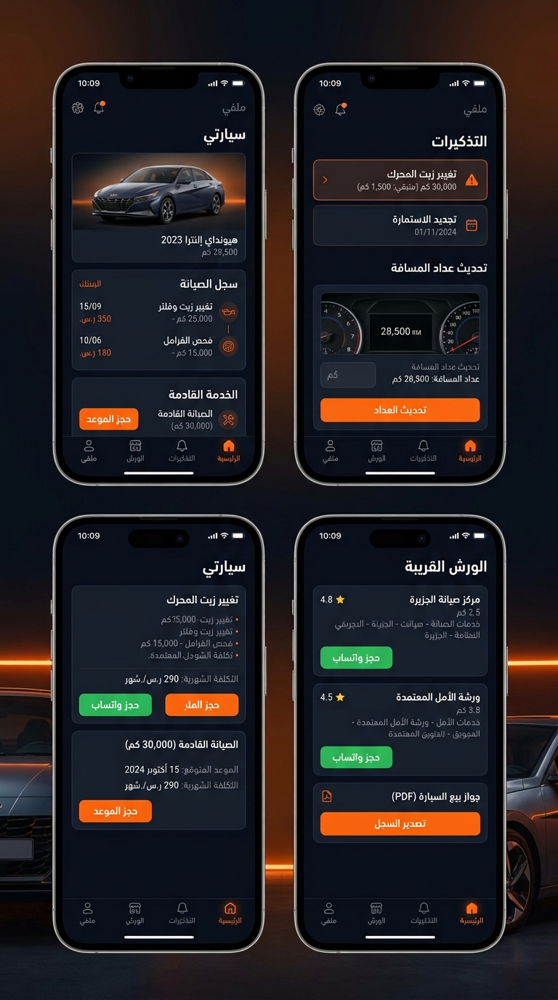
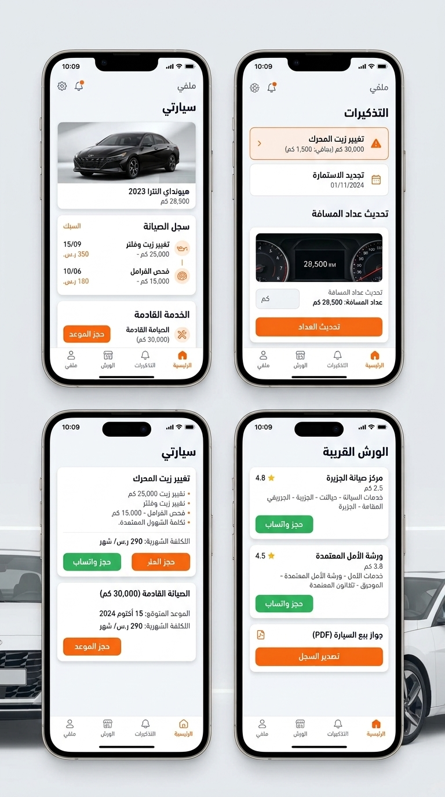
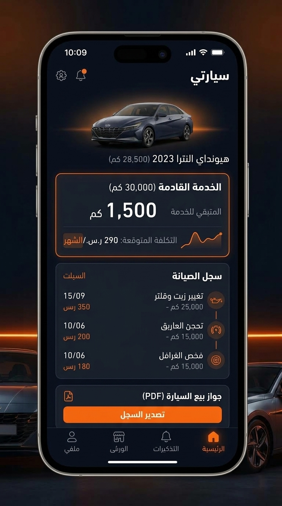

# CarPassport — كار الباسبور 🇪🇬

A Flutter demo for Egypt's car-service market: every car gets a **digital passport** — full service history, garage network, and a sale certificate that proves the car's story.

Built as a working mock APK in one day on Google Colab (Flutter stable, JDK 17 + Gradle 9.3.1, release-signed).

## Screens

| Dark | Light |
|---|---|
|  |  |



## Features (demo)

- **الجراجات (Garages)** — nearby garage list: name, area, distance, rating, tap-to-call
- **كار الباسبور (Car Passport)** — demo car (Peugeot 208) + expandable service history with cost & next-due km
- **الإعدادات (Settings)** — dark/light mode toggle, Arabic-first RTL UI

## Download

Grab the APK from [Releases](../../releases):

- `CarPassport-v1.1-arm64.apk` (16 MB) — any modern phone (2017+)
- `CarPassport-v1.1-armv7.apk` (13 MB) — older phones
- `CarPassport-v1.1-universal.apk` (44 MB) — works everywhere

Sideload: open from Files app → allow "Install unknown apps" → install. (Samsung: turn off Auto Blocker first.)

## Build it yourself

```bash
flutter create --platforms=android --org com.carpassport --project-name car_passport app_src
cp pubspec.yaml app_src/ && cp lib/main.dart app_src/lib/
cd app_src && flutter build apk --release --split-per-abi
```

APKs land in `build/app/outputs/flutter-apk/`. Full proven Colab chain (SDK, JDK pin, signing): ask for the `colab-flutter-apk-build` notes.

## Status

Demo v1.1 — validating with garages & car owners in Cairo before the next iteration.

Built by [Ahmed Geneed](https://g3need.github.io/) — [g3need.github.io](https://g3need.github.io/repos/)
